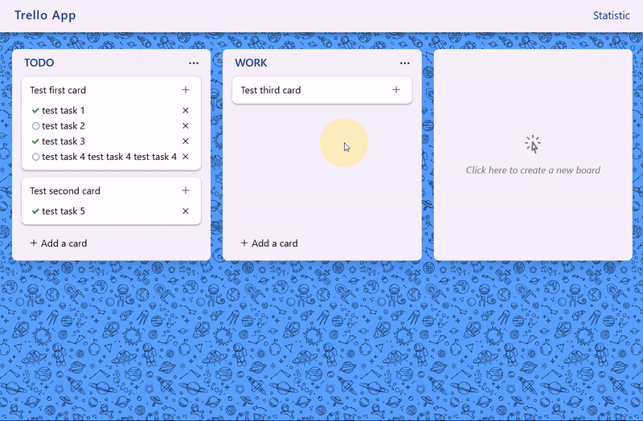
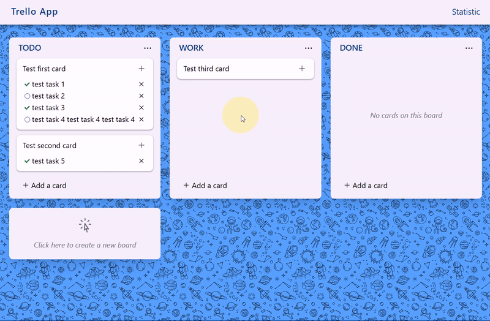
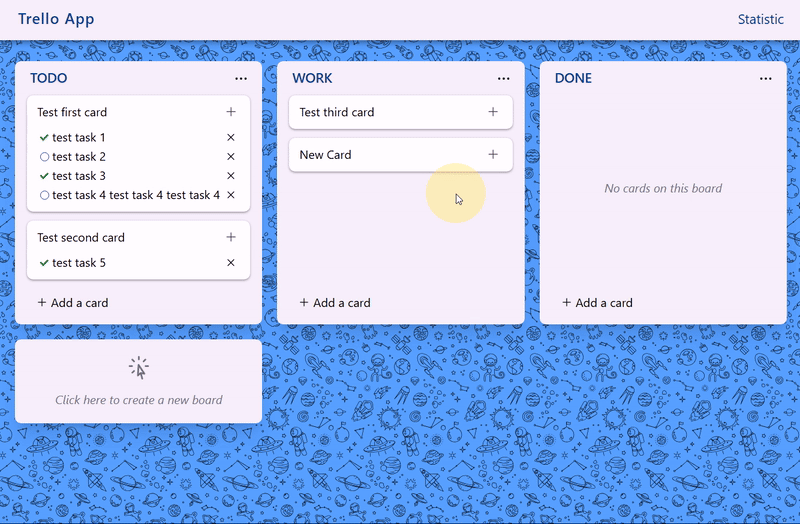
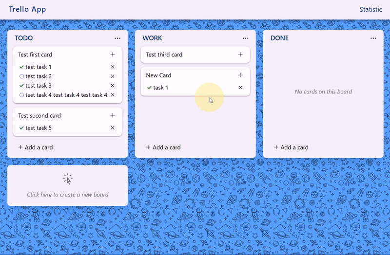
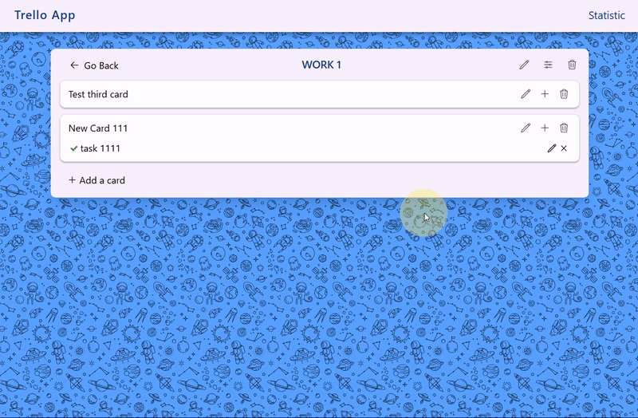
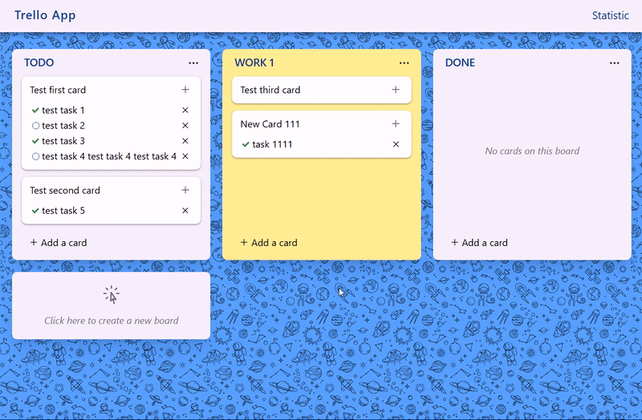
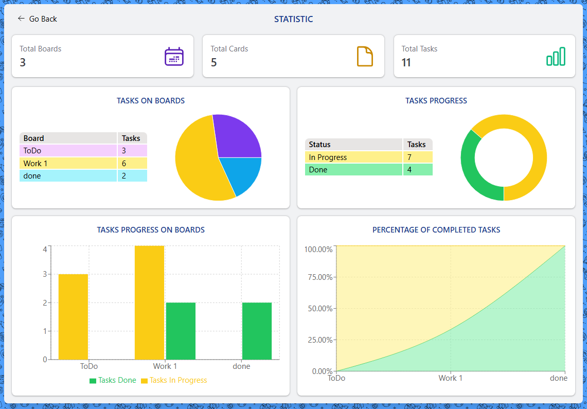

# Trello App

## Содержание

- [Trello App](#trello-app)
  - [Содержание](#содержание)
  - [О проекте](#о-проекте)
  - [Технологии](#технологии)
  - [Структура проекта](#структура-проекта)
  - [Примеры работы (скриншоты)](#примеры-работы-скриншоты)
  - [Установка](#установка)
  - [Использование](#использование)

## О проекте

Аналог приложения [Trello](https://trello.com/) от Fog Creek Software.

Данное приложение предназначено для управления проектами в небольших командах с помощью досок, карточек и списков задач. Упрощает работу вашей команды независимо от сферы проекта. Поможет вам поддерживать высокую организацию рабочего процесса. Приложение отслеживает вашу деятельность и отображает различные метрики на основании которых вы можете оценить продуктивность вашей команды.

## Технологии

- React (Hooks, Context API, Portal и др.)
- Redux Toolkit
- React Router (Data mode)
- Tailwind CSS
- Recharts
- React Icons
- Vite
- ESLint, Prettier

## Структура проекта

```
trello-app
├───src
│   ├───assets/...
│   ├───components
│   │   ├───Board/...
│   │   ├───Card/...
│   │   ├───Menu/...
│   │   ├───Modal/...
|   │   ├───Statistic/...
│   │   ├───Task/...
│   │   └───UI
│   │       ├───forms/...
│   │       └───Table/...
│   ├───context/...
│   ├───hooks/...
│   ├───pages
│   │   ├───BoardPage/...
│   │   ├───HomePage/...
│   │   ├───StatisticPage/...
│   │   ├───AppLayout.tsx
│   │   └───Router.tsx
│   ├───store/...
│   ├───types/...
│   ├───utils/...
│   ├───App.tsx
│   ├───main.tsx
│   └───style.css
└───index.html
```

## Примеры работы (скриншоты)

Создание новой доски:



Создание новой карточки:



Создание новых задач на карточке, изменение состояния выполнения задачи и удаление задачи:



Страница доски. Изменение заголовка доски, названия карточки и названия задачи:



Изменение цвета доски:



Перемещение карточек между досками:



Страница статистики:



## Установка

Для установки зависимостей:

```
npm i
```

## Использование

```
npm run dev
```

> [!TIP]
> По умолчанию в браузере можно открыть по адресу `localhost:5173`
